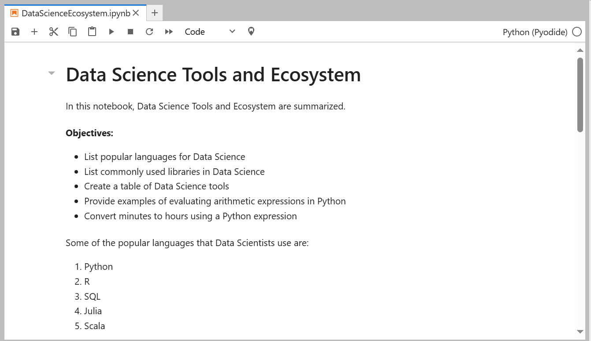

# Data Science Notebook Examples

This repository contains Jupyter Notebook examples exploring various concepts in Data Science using Python.

## Notebooks

- **Introduction**: Overview of Data Science Tools and Ecosystem
- **Popular Languages**: List and examples of popular languages used in Data Science
- **Common Libraries**: Introduction to commonly used libraries for Data Science tasks
- **Data Science Tools**: Table listing popular development environments used by Data Scientists
- **Arithmetic Expressions**: Examples of evaluating arithmetic expressions in Python
- **Time Conversion**: Example of converting minutes to hours using Python
- **Objectives**: Key takeaways and objectives covered in this notebook

## Screenshots



## Setup

To run the notebooks locally, make sure you have Python and Jupyter installed. You can install the necessary dependencies using pip:

```bash
pip install numpy pandas matplotlib scikit-learn tensorflow
